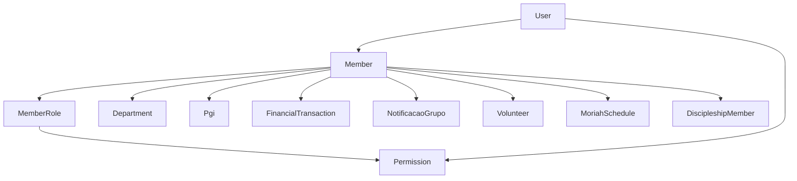
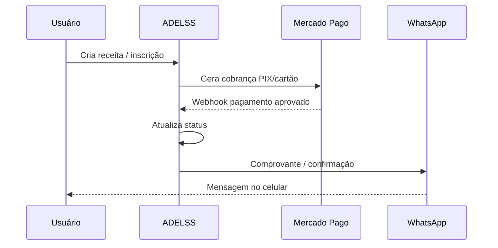
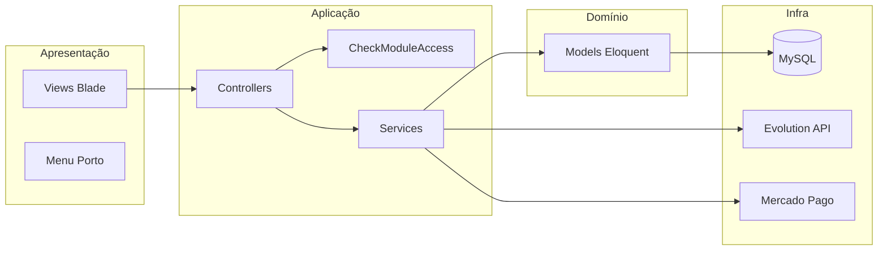

# Documentação da Estrutura do Sistema ADELSS

> **Sistema:** ADELSS — Sistema Web de Gestão Eclesiástica  
> **Stack:** Laravel 10, PHP 8.1+, MySQL, Blade (layout Porto Admin)  
> **Última revisão:** julho/2026  
> **Repositório:** `adelss/sistema-web`

---

## Sumário

1. [Visão geral](#1-visão-geral)
2. [Arquitetura técnica](#2-arquitetura-técnica)
3. [Autenticação, usuários e permissões](#3-autenticação-usuários-e-permissões)
4. [Entidade central: Membro](#4-entidade-central-membro)
5. [Módulos do sistema](#5-módulos-do-sistema)
6. [Integrações externas](#6-integrações-externas)
7. [Integrações entre módulos](#7-integrações-entre-módulos)
8. [Banco de dados por domínio](#8-banco-de-dados-por-domínio)
9. [Serviços de aplicação](#9-serviços-de-aplicação)
10. [Webhooks e rotas públicas](#10-webhooks-e-rotas-públicas)
11. [Tarefas agendadas](#11-tarefas-agendadas)
12. [Mapa de navegação (menu)](#12-mapa-de-navegação-menu)
13. [Diagramas de arquitetura](#13-diagramas-de-arquitetura)
14. [Pontos de atenção técnicos](#14-pontos-de-atenção-técnicos)

---

## 1. Visão geral

O **ADELSS** é um sistema integrado para gestão de igreja/organização religiosa. Ele centraliza cadastro de membros, finanças, departamentos, PGIs (Pequenos Grupos de Interesse), ensino, agenda de eventos, voluntariado, ministério de louvor (Moriah), notificações WhatsApp, discipulado e rifas.

### Princípios de design

| Princípio | Descrição |
|-----------|-----------|
| **Membro como hub** | Quase todos os módulos referenciam `Member` (telefone, cargo, PGI, departamento) |
| **Permissões granulares** | Acesso por módulo/recurso/ação (`financial.receitas.view`, etc.) |
| **WhatsApp unificado** | Evolution API como canal único de mensagens |
| **Evento como calendário** | `Event` é compartilhado entre Agenda, Serviço e Moriah |
| **Web MVC** | Interface Blade; API REST mínima (`routes/api.php` quase vazio) |

### Estrutura de pastas principal

```
adelss/
├── app/
│   ├── Console/Commands/       # Comandos artisan agendados
│   ├── Http/Controllers/       # Controllers por módulo
│   ├── Http/Middleware/        # CheckModuleAccess, auth, CSRF
│   ├── Models/                 # 66 models Eloquent
│   └── Services/               # WhatsApp, Mercado Pago, notificações
├── config/                     # whatsapp.php, financial.php, mercadopago.php
├── database/migrations/        # ~112 migrations
├── resources/views/            # Blade por módulo
└── routes/web.php              # Rotas principais
```

---

## 2. Arquitetura técnica

### Dependências principais (`composer.json`)

| Pacote | Uso |
|--------|-----|
| `laravel/framework ^10` | Framework base |
| `barryvdh/laravel-dompdf` | PDFs (recibos, escalas, metas discipulado) |
| `mercadopago/dx-php` | Pagamentos PIX/cartão |
| `guzzlehttp/guzzle` | HTTP client (Evolution API, Mercado Pago) |
| `mews/purifier` | Sanitização HTML |
| `setasign/fpdf` / `fpdi` | Manipulação PDF adicional |

### Layout e UI

- **Layout principal:** `resources/views/layouts/porto.blade.php`
- **Menu lateral:** definido no layout, com checagem de permissões por item
- **Dashboard:** rota `/` → `resources/views/dashboard.blade.php`

### Fluxo de requisição autenticada

```
Browser → web.php → middleware auth → middleware module.access:{modulo}
       → Controller → Service (opcional) → Model → View Blade
```

---

## 3. Autenticação, usuários e permissões

### Autenticação

| Rota | Controller | Descrição |
|------|------------|-----------|
| `GET /login` | `AuthController@showLoginForm` | Tela de login |
| `POST /login` | `AuthController@login` | Autenticação |
| `POST /logout` | `AuthController@logout` | Encerrar sessão |

### Modelo `User`

- Arquivo: `app/Models/User.php`
- Relacionamentos:
  - `belongsTo Member` — cada usuário pode estar vinculado a um membro
  - `belongsToMany Permission` — permissões diretas (`permission_user`)
- Método `hasPermission($key)`:
  - **Admin** (`is_admin = true`): acesso total
  - **Demais:** permissões do usuário + permissões herdadas do `MemberRole` do membro vinculado

### Modelo `Permission`

- Arquivo: `app/Models/Permission.php`
- Estrutura **hierárquica** (`parent_id` → filhos)
- Chaves no padrão: `{modulo}.{recurso}.{acao}`
- Seed: `database/seeders/PermissionSeeder.php`

### Módulos com permissões seedadas

| Módulo | Prefixo de keys | Exemplos |
|--------|-----------------|----------|
| Membros | `members.*` | `members.index.view`, `members.roles.edit` |
| PGIs | `pgis.*` | `pgis.index.create` |
| Ensino | `ensino.*` | `ensino.turmas.view`, `ensino.estudos.manage` |
| Financeiro | `financial.*` | `financial.receitas.create`, `financial.despesas.view` |
| Agenda | `agenda.*` | `agenda.eventos.edit`, `agenda.categories.view` |
| Serviço | `servico.*` | `servico.departments.view`, `servico.schedules.manage` |
| Notificações | `notificacoes.*` | `notificacoes.grupos.view`, `notificacoes.enquetes.manage` |
| Discipulado | `discipleship.*` | `discipleship.cycles.view`, `discipleship.members.manage` |
| Rifas | `rifas.*` | `rifas.index.view`, `rifas.vendas.create` |

### Gestão de permissões

| Rota | Descrição |
|------|-----------|
| `GET /permissoes` | Tela de permissões por membro/usuário |
| `PUT /permissoes/{member}` | Atualizar permissões do membro |
| `PUT /permissoes/funcoes/{role}` | Atualizar permissões do cargo (`MemberRole`) |

Controller: `app/Http/Controllers/PermissionController.php`

### Middleware `CheckModuleAccess`

- Arquivo: `app/Http/Middleware/CheckModuleAccess.php`
- Registrado como alias `module.access` em `app/Http/Kernel.php`
- Fluxo:
  1. Verifica autenticação
  2. Admin → passa direto
  3. Analisa rota/ação e exige permissão específica

**Módulos com middleware ativo:** `members`, `pgis`, `ensino`, `agenda`, `financial`, `servico`, `rifas`, `discipleship`

**Módulos sem `module.access` (apenas `auth`):** Notificações, Moriah

### Regras especiais de acesso

| Contexto | Regra |
|----------|-------|
| PGIs | Membros/líderes do PGI acessam mesmo sem permissão global |
| Ensino / Estudos | Visualização liberada para autenticados |
| Ensino / Turmas | Alunos e professores da turma acessam contextualmente |
| Agenda | Visualização liberada; CRUD exige permissão |
| Membros | Usuário pode ver/editar próprio perfil |
| Financeiro / Tesoureiro | Cargo `Tesoureiro(a)` recebe alertas WhatsApp de despesas |

---

## 4. Entidade central: Membro

### Model `Member`

**Arquivo:** `app/Models/Member.php`

### Campos relevantes para integrações

| Campo | Uso |
|-------|-----|
| `name`, `email`, `phone` | Identificação e WhatsApp |
| `role_id` | Cargo (`MemberRole`) — permissões e tesoureiro |
| `department_id` | Departamento principal |
| `pgi_id` | PGI vinculado |
| `status` | Ativo/inativo |
| `cpf`, `birth_date`, `address` | Cadastro completo |

### Relacionamentos principais

```
Member
├── belongsTo MemberRole (cargo)
├── belongsTo Department (departamento principal)
├── belongsTo Pgi
├── belongsToMany Department (department_members + department_role_id)
├── belongsToMany Turma (class_students) — aluno
├── belongsToMany Discipline (discipline_teachers) — professor
├── belongsToMany NotificacaoGrupo (grupo_member)
├── belongsToMany MoriahFunction (member_moriah_functions)
├── hasOne User (login)
├── hasMany FinancialTransaction (dízimos/receitas)
├── hasMany DiscipleshipMember
├── hasMany RifaVenda / NumeroRifa (vendedor)
└── hasMany MeetingAttendance (PGI)
```

### Model `MemberRole` (Cargos)

- Exemplos de cargos: Pastor, Tesoureiro(a), Líder de PGI, etc.
- Template CSV: `template_cargos.csv`
- Relacionamentos:
  - `hasMany Member`
  - `belongsToMany Permission` (`permission_role`)

---

## 5. Módulos do sistema

### 5.1 Membros

**Prefixo de rotas:** `/members`, `/member-roles`  
**Middleware:** `module.access:members`  
**Controllers:** `MemberController`, `MemberRoleController`

#### Funcionalidades

| Funcionalidade | Rota / recurso |
|----------------|----------------|
| CRUD de membros | `members.*` |
| Importação CSV | `members/import`, template disponível |
| CRUD de cargos | `member-roles.*` |
| Importação de cargos | `member-roles/import` |
| Permissões | submenu em Membros → `/permissoes` |

#### Integrações

- Vincula `User` para login
- `phone` usado em todo envio WhatsApp
- `role_id` define permissões herdadas e cargo de tesoureiro
- Base para PGIs, financeiro, rifas, discipulado, Moriah

---

### 5.2 PGIs (Pequenos Grupos de Interesse)

**Prefixo:** `/pgis`  
**Middleware:** `module.access:pgis`  
**Controllers:** `PgiController`, `MeetingController`

#### Funcionalidades

| Funcionalidade | Descrição |
|----------------|-----------|
| CRUD de PGIs | Líderes, logo, banner |
| Membros do PGI | attach/detach de membros |
| Reuniões | CRUD dentro de cada PGI |
| Presença | `MeetingAttendance` |
| Notificações | Envio WhatsApp/enquete ao PGI |

#### Modelos

- `Pgi` — grupo com até 4 campos de liderança (`Member`)
- `Meeting` — reunião do PGI
- `MeetingAttendance` — presença

#### Integração WhatsApp

- `POST pgis/{pgi}/notificacoes/enviar` → `PgiController@enviarNotificacao`
- Usa `NotificacaoService` e `EnqueteService`

---

### 5.3 Financeiro

**Prefixo:** `/financial`  
**Middleware:** `module.access:financial`  
**Controllers:** `Financial/SummaryController`, `TransactionController`, `CheckoutController`, `ReportController`, `CategoryController`, `AccountController`, `ContactController`, `CostCenterController`

#### Submódulos

| Tela | Rota | Descrição |
|------|------|-----------|
| Resumo | `/financial/summary` | Dashboard financeiro |
| Transações | `/financial/transactions` | Receitas e despesas |
| Relatórios | `/financial/reports/*` | Fluxo de caixa, extratos, resumos anuais |
| Categorias | `/financial/categories` | Dízimo, Oferta, despesas diversas |
| Contas | `/financial/accounts` | Contas bancárias/caixa |
| Contatos | `/financial/contacts` | Fornecedores (despesas) |
| Centros de custo | `/financial/cost-centers` | Rateio por área/departamento |

#### Modelo `FinancialTransaction`

| Campo | Descrição |
|-------|-----------|
| `type` | `receita` ou `despesa` |
| `status` | `recebido`, `a_receber`, `pago`, `a_pagar` |
| `member_id` | Membro (receitas — dízimo/oferta) |
| `received_from_other` | Receita de "Outros" |
| `contact_id` | Fornecedor (despesas) |
| `category_id` | Categoria financeira |
| `due_date` | Vencimento |
| `created_by` | Usuário que registrou |

#### Categorias e comprovante WhatsApp

- `FinancialCategory.sends_receipt` — flag para enviar comprovante
- `FinancialCategory.slug` — ex.: `dizimo`, `oferta`
- Migration auto-marca categorias com "dízimo"/"oferta" no nome

#### Fluxos financeiros

**Receita (dízimo/oferta):**
1. Cadastro manual ou importação CSV
2. Opcional: checkout Mercado Pago (PIX/cartão) para receitas em aberto
3. Ao confirmar pagamento → comprovante WhatsApp ao membro (PDF + texto)
4. Recibo imprimível: `/financial/transactions/{id}/receipt`
5. Reenvio manual: `POST .../send-receipt`

**Despesa:**
1. Cadastro com status `a_pagar`
2. Notificação automática ao tesoureiro via WhatsApp
3. Lembrete diário de vencimentos (comando agendado)

#### Serviço dedicado

- `app/Services/FinancialNotificationService.php`
- Log: tabela `financial_notification_logs`

#### Configuração (`.env`)

```env
FINANCIAL_WHATSAPP_DIZIMO=true
FINANCIAL_WHATSAPP_DESPESA=true
FINANCIAL_WHATSAPP_DESPESA_VENCIMENTO=true
FINANCIAL_WHATSAPP_PDF_RECEIPT=true
FINANCIAL_DESPESA_LEMBRETE_DIAS=1
```

Arquivo: `config/financial.php`

#### Integração Mercado Pago (receitas)

- `CheckoutController` — PIX e cartão
- `PaymentTransaction` — registro de cobrança
- Webhook confirma pagamento e dispara comprovante

#### Integração Departamentos

- Tabela pivot `cost_center_departments` liga centros de custo a departamentos

---

### 5.4 Departamentos e Serviço (Voluntários)

**Prefixo departamentos:** `/departments`  
**Prefixo serviço:** `/servico/voluntarios`  
**Middleware:** `module.access:servico`  
**Controllers:** `DepartmentController`, `VolunteerController`, `ServiceAreaController`, `ServiceScheduleController`, `MonthlyCultoScheduleController`, `ServiceHistoryController`, `VolunteerReportController`

#### Departamentos

| Model | Descrição |
|-------|-----------|
| `Department` | Departamento da igreja |
| `DepartmentRole` | Função dentro do departamento |
| `DepartmentMember` | Membro ↔ departamento (pivot) |
| `Department` leaders | Líderes via `department_leaders` |

Usado em:
- Organização de membros
- Notificações por departamento (`NotificacaoService@enviarParaDepartamento`)
- Centros de custo financeiros

#### Voluntários e escalas

| Submódulo | Descrição |
|-----------|-----------|
| Cadastro de voluntários | `Volunteer` vinculado a `Member` |
| Áreas de serviço | `ServiceArea` |
| Escalas por evento | `ServiceSchedule` + voluntários por área |
| Escalas mensais de culto | `MonthlyCultoSchedule` (preletores, dirigentes, portaria) |
| Histórico | `ServiceHistory` |
| Relatórios | Dashboard, ativos, inativos, déficit |

#### Integração WhatsApp (escalas mensais)

- `POST escalas-mensais/volunteers/notify` — notifica voluntário
- `POST escalas-mensais/{escala}/volunteers/notify-all` — notifica todos

#### Integração Agenda

- Escalas referenciam `Event` (`event_id`)
- Cultos mensais geram/vinculam eventos no calendário

---

### 5.5 Notificações (WhatsApp)

**Prefixo:** `/notificacoes`  
**Middleware:** apenas `auth` (menu filtra por permissão)  
**Controllers:** `Notificacoes/GrupoController`, `EnqueteController`, `PainelController`, `ConfigController`, `TemplateController`

#### Submódulos

| Tela | Rota | Descrição |
|------|------|-----------|
| Grupos | `/notificacoes/grupos` | Agrupamento de membros para envio |
| Enquetes | `/notificacoes/enquetes` | Enquetes com botões WhatsApp |
| Painel | `/notificacoes/painel` | Envio avulso de mensagens |
| Config WPP | `/notificacoes/config` | Evolution API: instâncias, QR, webhook |
| Templates | `/notificacoes/templates` | Modelos de mensagem |

#### Modelos

| Model | Descrição |
|-------|-----------|
| `NotificacaoGrupo` | Grupo de membros |
| `Enquete` | Enquete com opções |
| `EnqueteEnvio` | Registro de envio por telefone |
| `EnqueteResposta` | Resposta recebida via webhook |
| `NotificacaoEnviada` | Histórico geral de mensagens |
| `ConfiguracaoWhatsapp` | Config persistida |
| `ConfiguracaoMensagem` | Templates |

#### Serviços

| Serviço | Responsabilidade |
|---------|------------------|
| `WhatsAppService` | Cliente Evolution API (texto, mídia, PDF, enquetes) |
| `NotificacaoService` | Envio para membro, grupo, departamento |
| `EnqueteService` | Envio e processamento de respostas |

#### Configuração Evolution API

Arquivo: `config/whatsapp.php`

```env
WHATSAPP_API_URL=https://wpp.exemplo.com
WHATSAPP_API_KEY=
WHATSAPP_INSTANCE_NAME=evolutionapi
WHATSAPP_WEBHOOK_URL=
```

#### Webhook de respostas

- `POST /webhook` → `EvolutionWebhookController`
- Processa `MESSAGES_UPSERT` (botões, texto)
- Atualiza `enquete_respostas` e envia agradecimento

#### Normalização de telefone BR

- `WhatsAppService::normalizarNumero()` — 9º dígito celular
- `variantesNumero()` — busca equivalente com/sem 9

---

### 5.6 Agenda e Eventos

**Prefixo:** `/agenda`  
**Middleware:** `module.access:agenda`  
**Controllers:** `Agenda/CalendarioController`, `EventController`, `EventosController`, `EventCategoryController`, `PublicEventController`

#### Submódulos

| Tela | Descrição |
|------|-----------|
| Calendário | FullCalendar com todos os eventos |
| Eventos | CRUD de eventos gerais (conferências, retiros, etc.) |
| Categorias | Categorias de evento |

#### Modelo `Event` (hub do calendário)

Compartilhado por:
- Agenda (visualização)
- Serviço (escalas)
- Moriah (escalas de louvor)
- Escalas mensais de culto

Campos relevantes: `start_date`, `end_date`, `status`, `is_paid`, `price`, `slug` (landing pública)

#### Inscrições públicas

| Rota | Descrição |
|------|-----------|
| `GET /evento/{slug}` | Landing pública do evento |
| `POST /evento/{slug}/inscricao` | Inscrição + pagamento Mercado Pago |

Modelos:
- `EventRegistration` — inscrição
- `EventRegistrationPayment` — pagamento MP
- `EventRegistrationField` — campos customizados
- `EventSpeaker` — palestrantes

#### Integração Mercado Pago (eventos)

- Inscrição paga gera cobrança PIX/cartão
- Webhook confirma → status `confirmado`
- Envio manual de PIX por WhatsApp: `EventosController`

---

### 5.7 Ensino

**Prefixo:** `/ensino`  
**Middleware:** `module.access:ensino`  
**Controllers:** `Ensino/EstudosController`, `EscolasController`, `TurmasController`

#### Hierarquia

```
School (Escola)
└── Turma (Class)
    ├── Discipline (Disciplina)
    │   └── Lesson (Aula)
    │       └── LessonAttendance (Presença)
    ├── ClassFile (Arquivos)
    └── Members (alunos via class_students)
```

#### Estudos

- `Study` — conteúdo de estudo independente (acesso amplo)

#### Permissões contextuais

- Professor da disciplina acessa turma
- Aluno matriculado acessa turma

---

### 5.8 Discipulado

**Prefixo:** `/discipleship`  
**Middleware:** `module.access:discipleship`  
**Controllers:** `Discipleship/*Controller`

#### Fluxo

```
DiscipleshipCycle (Ciclo)
└── DiscipleshipMember (Membro no ciclo + discipulador User)
    ├── DiscipleshipMeeting (Encontros)
    ├── DiscipleshipIndicatorValue (Indicadores)
    ├── DiscipleshipGoal (Propósitos/Metas)
    └── DiscipleshipFeedback (Feedbacks)
```

#### Telas

| Tela | Descrição |
|------|-----------|
| Ciclos | Períodos de discipulado |
| Membros | Vinculação membro ↔ ciclo ↔ discipulador |
| Encontros | Registro de encontros |
| Indicadores | Métricas de acompanhamento |
| Propósitos | Metas com export PDF |
| Feedbacks | Registro qualitativo |
| Dashboard | Visão discipulador e liderança |

---

### 5.9 Moriah (Ministério de Louvor)

**Prefixo:** `/moriah`  
**Middleware:** apenas `auth`  
**Controllers:** `MoriahController`, `MoriahFunctionController`, `MoriahScheduleController`, `MoriahUnavailabilityController`, `RepertorioController`

#### Submódulos

| Submódulo | Descrição |
|-----------|-----------|
| Ministério | Membros e funções no ministério |
| Escalas | `MoriahSchedule` vinculada a `Event` |
| Repertório | Pastas, músicas (`Song`, `Folder`) |
| Indisponibilidades | Períodos em que membro não pode servir |

#### Modelos-chave

- `MoriahFunction` — função (vocal, instrumento, etc.)
- `MoriahSchedule` — escala com membros e músicas
- `MoriahUnavailability` — bloqueio de datas

---

### 5.10 Rifas

**Prefixo:** `/rifas`  
**Middleware:** `module.access:rifas`  
**Controllers:** `Rifas/RifaController`, `CartelaController`, `VendaRapidaController`, `RelatorioController`

#### Fluxo

```
Rifa
├── NumeroRifa (números)
├── Cartela / CartelaNumero
├── RifaVenda
└── SorteioRifa
```

- Vendedor: `Member` (`vendedor_id`)
- Venda manual/rápida (sem gateway online)
- Relatórios CSV/PDF

---

## 6. Integrações externas

### 6.1 Evolution API (WhatsApp)

| Aspecto | Detalhe |
|---------|---------|
| **Config** | `config/whatsapp.php` |
| **Serviço** | `WhatsAppService` |
| **Endpoints usados** | `sendText`, `sendMedia`, `sendButtons`, `webhook/set/{instance}` |
| **Casos de uso** | Notificações, enquetes, comprovantes financeiros, PIX eventos, escalas |

### 6.2 Mercado Pago

| Aspecto | Detalhe |
|---------|---------|
| **Config** | `config/mercadopago.php` |
| **Serviço** | `MercadoPagoService` |
| **Webhook** | `POST /webhooks/mercado-pago` |
| **Casos de uso** | Receitas financeiras (PIX/cartão), inscrições de eventos |

Variáveis `.env`:
```env
MP_ACCESS_TOKEN=
MP_PUBLIC_KEY=
MP_WEBHOOK_SECRET=
MP_SANDBOX=true
```

### 6.3 DomPDF

- Recibos financeiros (`receipt-pdf.blade.php`)
- Escalas de serviço e Moriah
- Metas de discipulado
- Relatórios de rifas

---

## 7. Integrações entre módulos

### 7.1 Mapa de integrações

```
                    ┌─────────────┐
                    │   Member    │
                    │ (telefone,  │
                    │  cargo, pgi)│
                    └──────┬──────┘
           ┌───────────────┼───────────────┐
           ▼               ▼               ▼
    ┌────────────┐  ┌────────────┐  ┌────────────┐
    │ Financeiro │  │Notificações│  │Departamento│
    │ dízimo/rec.│  │  WhatsApp  │  │ + Serviço  │
    └─────┬──────┘  └─────┬──────┘  └─────┬──────┘
          │               │               │
          ▼               ▼               ▼
    ┌────────────┐  ┌────────────┐  ┌────────────┐
    │ Mercado    │  │  Enquetes  │  │   Event    │
    │ Pago       │  │  (webhook) │  │ (calendário)│
    └────────────┘  └────────────┘  └─────┬──────┘
                                          │
                              ┌───────────┼───────────┐
                              ▼           ▼           ▼
                         Serviço      Moriah      Eventos
                         (escalas)   (louvor)   (inscrição)
```

### 7.2 Integrações detalhadas

| Origem | Destino | Como |
|--------|---------|------|
| Membro | WhatsApp | `Member.phone` → todos os serviços de envio |
| Membro | Permissões | `User` + `MemberRole` → `hasPermission()` |
| Membro | Financeiro | `FinancialTransaction.member_id` (dízimo) |
| Cargo Tesoureiro | Financeiro | Busca por `MemberRole.name LIKE %Tesoureiro%` |
| Financeiro | WhatsApp | `FinancialNotificationService` (comprovante, alerta) |
| Financeiro | Mercado Pago | `CheckoutController` + webhook |
| Financeiro | Departamento | `cost_center_departments` |
| Evento | Serviço/Moriah | `event_id` nas escalas |
| Evento | Mercado Pago | Inscrição paga → `EventRegistrationPayment` |
| Evento | WhatsApp | PIX manual para inscrito |
| PGI | WhatsApp | `PgiController@enviarNotificacao` |
| Departamento | WhatsApp | `NotificacaoService@enviarParaDepartamento` |
| Enquete | Webhook | Resposta → `EnqueteResposta` + agradecimento |
| PGIs | Membros | `pgi_id`, reuniões, presença |
| Ensino | Membros | Alunos/professores em turmas |
| Discipulado | Membros/Users | Discipulador = `User`, discípulo = `Member` |
| Rifas | Membros | Vendedor/comprador |

### 7.3 Fluxo: Dízimo com comprovante

```
1. Usuário registra receita (categoria Dízimo/Oferta, membro, pago)
2. TransactionController → FinancialNotificationService
3. Gera PDF (DomPDF) + mensagem WhatsApp
4. WhatsAppService → Evolution API → Member.phone
5. Log em financial_notification_logs
```

### 7.4 Fluxo: Despesa → Tesoureiro

```
1. Usuário registra despesa (status a_pagar)
2. FinancialNotificationService busca membros com cargo Tesoureiro
3. Envia alerta WhatsApp com valor, vencimento, fornecedor
4. Comando diário re-notifica despesas com due_date próximo
```

### 7.5 Fluxo: Enquete com resposta

```
1. EnqueteController/PGI envia enquete (botões WhatsApp)
2. EnqueteEnvio registrado por telefone
3. Membro clica no botão → Evolution webhook POST /webhook
4. EnqueteService processa, grava EnqueteResposta
5. Envia mensagem de agradecimento
```

---

## 8. Banco de dados por domínio

### Core / Autenticação
- `users`, `members`, `member_roles`
- `permissions`, `permission_user`, `permission_role`

### Membros / Organização
- `departments`, `department_members`, `department_roles`, `department_leaders`
- `pgis`, `meetings`, `meeting_attendances`

### Financeiro
- `financial_categories`, `financial_accounts`, `financial_cost_centers`
- `financial_contacts`, `financial_contact_categories`
- `cost_center_departments`
- `financial_transactions`, `financial_transaction_attachments`
- `payment_transactions`
- `financial_notification_logs`

### Notificações
- `notificacao_grupos`, `grupo_member`
- `notificacao_enquetes`, `enquete_envios`, `enquete_respostas`
- `notificacoes_enviadas`
- `configuracoes_whatsapp`, `configuracoes_mensagens`

### Agenda / Eventos
- `event_categories`, `events`
- `event_schedule_items`, `event_registration_fields`
- `event_speakers`, `event_registrations`
- `event_registration_payments`

### Serviço / Voluntários
- `service_areas`, `volunteers`, `volunteer_service_areas`
- `volunteer_availability`, `volunteer_availability_events`
- `service_schedules`, `service_schedule_areas`, `service_schedule_volunteers`
- `service_histories`
- `monthly_culto_schedules` + tabelas pivot (preletores, dirigentes, portaria, áreas)

### Moriah
- `moriah_functions`, `member_moriah_functions`
- `folders`, `songs`
- `moriah_schedules`, `moriah_schedule_members`, `moriah_schedule_songs`
- `moriah_unavailabilities`

### Ensino
- `studies`, `schools`, `classes`, `class_students`
- `disciplines`, `discipline_teachers`
- `lessons`, `lesson_attendances`, `class_files`

### Discipulado
- `discipleship_cycles`, `discipleship_members`
- `discipleship_meetings`, `discipleship_indicators`, `discipleship_indicator_values`
- `discipleship_goals`, `discipleship_meeting_goal`, `discipleship_feedbacks`

### Rifas
- `rifas`, `numeros_rifa`, `rifa_vendas`
- `cartelas`, `cartela_numero`, `rifa_sorteios`

---

## 9. Serviços de aplicação

| Serviço | Arquivo | Responsabilidade |
|---------|---------|------------------|
| `WhatsAppService` | `app/Services/WhatsAppService.php` | Evolution API: texto, mídia, PDF, enquetes, instâncias |
| `NotificacaoService` | `app/Services/NotificacaoService.php` | Orquestra envios; registra `NotificacaoEnviada` |
| `EnqueteService` | `app/Services/EnqueteService.php` | Enquetes + processamento webhook |
| `FinancialNotificationService` | `app/Services/FinancialNotificationService.php` | Comprovantes, alertas despesa, lembretes |
| `MercadoPagoService` | `app/Services/Payments/MercadoPagoService.php` | PIX, cartão, consulta pagamento |
| `RifaService` | `app/Services/RifaService.php` | Lógica de rifas |
| `VendaRifaService` | `app/Services/VendaRifaService.php` | Vendas de rifas |

---

## 10. Webhooks e rotas públicas

### Rotas sem autenticação

| Rota | Controller | CSRF |
|------|------------|------|
| `GET /evento/{slug}` | `PublicEventController@show` | N/A |
| `POST /evento/{slug}/inscricao` | `PublicEventController@register` | Sim |
| `POST /webhooks/mercado-pago` | `MercadoPagoWebhookController` | **Isento** |
| `POST /webhook` | `EvolutionWebhookController` | **Isento** |
| `POST /webhook/{event}` | `EvolutionWebhookController` | **Isento** |

Exceções CSRF: `app/Http/Middleware/VerifyCsrfToken.php` → `webhook`, `webhook/*`, `webhooks/*`

### Desenvolvimento local (webhook WhatsApp)

```
Evolution API → Ultrahook → http://127.0.0.1:8000/webhook
```

Variável: `WHATSAPP_WEBHOOK_URL` apontando para URL pública do tunnel.

---

## 11. Tarefas agendadas

Arquivo: `app/Console/Kernel.php`

| Comando | Frequência | Descrição |
|---------|------------|-----------|
| `events:check-past` | A cada hora | Marca eventos passados como concluídos |
| `financial:notify-due-expenses` | Diário 08:00 | Lembretes WhatsApp de despesas a vencer |

Comando financeiro: `app/Console/Commands/NotifyDueFinancialExpenses.php`

**Requisito produção:** cron do servidor executando `php artisan schedule:run` a cada minuto.

---

## 12. Mapa de navegação (menu)

Definido em `resources/views/layouts/porto.blade.php`:

| Menu | Subitens | Permissão típica |
|------|----------|------------------|
| Dashboard | — | Todos autenticados |
| Membros | Ver Todos, Cargos, Permissões | `members.*` |
| PGIs | Listar PGIs | `pgis.*` |
| Ensino | Estudos, Escolas, Turmas | `ensino.*` |
| Financeiro | Resumo, Transações, Relatórios, Categorias, Contas, Contatos, Centros de custo | `financial.*` |
| Agenda | Calendário, Eventos | `agenda.*` |
| Serviço | Departamentos, Áreas, Escalas Mensais, Histórico, Relatórios | `servico.*` |
| Rifas | Cadastro, Vendas, Relatórios | `rifas.*` |
| Moriah | Escalas, Repertório, Ministério, Indisponibilidades | Todos autenticados |
| Notificações | Grupos, Enquetes, Painel, Config WPP, Templates | `notificacoes.*` |
| Discipulado | Ciclos, Membros, Encontros, Indicadores, Propósitos, Feedbacks, Dashboard, Ajuda | `discipleship.*` |

---

## 13. Diagramas de arquitetura

### Hub central



### Integrações de pagamento



### Camadas do sistema



---

## 14. Pontos de atenção técnicos

### Segurança de rotas

No arquivo `routes/web.php`, o grupo `Route::middleware('auth')` fecha na linha ~289, mas **várias rotas sensíveis** (PGIs, Financeiro, Ensino, Agenda, importação de membros) estão **fora** desse grupo por indentação. Recomenda-se revisar e garantir que todas exijam autenticação.

### Middleware Discipulado

O middleware `CheckModuleAccess` possui case para `discipleship` — verificar se todas as rotas estão cobertas corretamente para usuários não-admin.

### Moriah e Notificações

Não usam `module.access`; qualquer usuário autenticado pode acessar as rotas diretamente (o menu filtra, mas a URL não).

### Campo crítico: telefone do membro

Sem `Member.phone` válido, falham:
- Comprovantes de dízimo
- Alertas ao tesoureiro
- Enquetes e notificações
- PIX por WhatsApp em eventos

### Instância WhatsApp ativa

A instância Evolution em uso é cacheada (`whatsapp.active_instance_name`) e selecionada em Notificações → Configuração WPP.

---

## Referências rápidas de arquivos

| Área | Arquivos principais |
|------|---------------------|
| Rotas | `routes/web.php` |
| Permissões | `app/Http/Middleware/CheckModuleAccess.php`, `database/seeders/PermissionSeeder.php` |
| Membro | `app/Models/Member.php` |
| Financeiro | `app/Http/Controllers/Financial/*`, `app/Services/FinancialNotificationService.php` |
| WhatsApp | `app/Services/WhatsAppService.php`, `config/whatsapp.php` |
| Mercado Pago | `app/Services/Payments/MercadoPagoService.php`, `app/Http/Controllers/Webhooks/MercadoPagoWebhookController.php` |
| Menu | `resources/views/layouts/porto.blade.php` |
| Layout transações | `resources/views/financial/transactions/index.blade.php` |

---

*Documento gerado com base na estrutura real do código-fonte do projeto ADELSS.*
